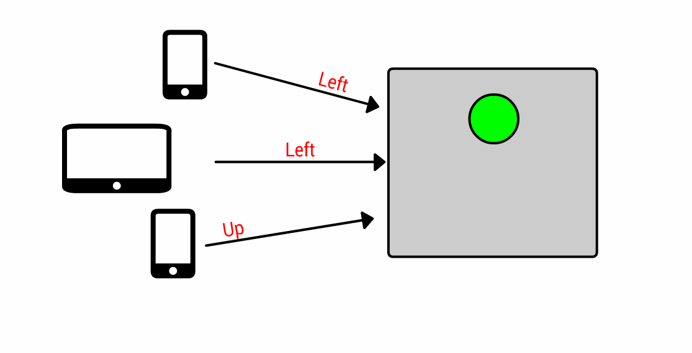
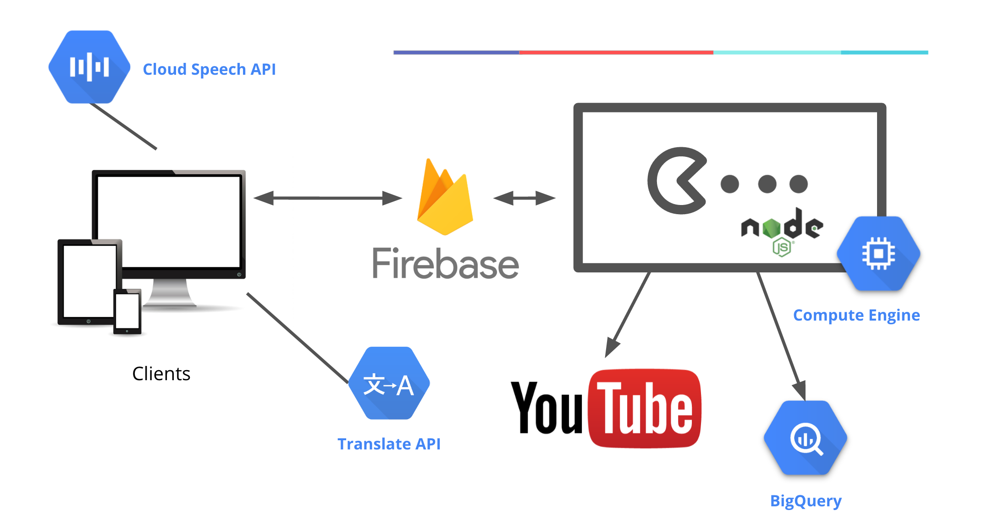

This is not an official Google product.

# Crowdsourced Realtime Gaming

We decided to get a little crazy and build a real time, crowdsourced, and live streamed gaming platform.

Imagine players all over the world shouting "up! down! left! right!" into their computers and phones to control a common character while chatting in different languages.

Inspired by [Twitch Plays Pokémon](https://en.wikipedia.org/wiki/Twitch_Plays_Pok%C3%A9mon), this game uses [Firebase](https://firebase.google.com) to crowdsource input from thousands of players in real time, then a Node.js process running on a [Google Compute Engine](https://cloud.google.com/compute/) Windows VM sends these crowdsourced commands to a game, and live streams it all to YouTube.



The game's web front end uses the power of [Google Cloud Machine Learning](https://cloud.google.com/products/machine-learning/) to enable realtime voice transcription and translation.

Finally, [BigQuery](https://cloud.google.com/bigquery/) gives us the power of big data to analyse all the commands and find interesting patterns.



This is originally presented at Google I/O 2016. You can watch the talk here:


# Setup

There are three components of this demo that run in the cloud:
- **Firebase** handles all of the real-time data syncing between multiple players and the game server. Firebase will handle relaying commands from every player to the server, as well as syncing chat messages between players.
- **The game server** is a Windows virtual machine running on [Google Compute Engine](https://cloud.google.com/compute/). It runs the game natively, relays user commands to the game, and streams everything to YouTube Live.
- **BigQuery** is the cloud data analytics platform that will receive all game events, and supports using SQL to query various reports.

## Set up your Firebase and Google Cloud Platform project

1. Create a new [Firebase project](https://firebase.google.com).
2. Click **Add Firebase to your web app** to get the Firebase and Google Cloud Platform connection settings:
    - API key
    - Database URL
    - Project ID.

Follow the instructions [here](https://firebase.google.com/docs/web/setup) to extract your project ID.

The settings should look something like:
```js
var config = {
  apiKey: '...',
  databaseURL: '...',
  projectId: '...'
};
```
Replace the placeholders in [frontend/public/config.js](frontend/public/config.js) with these values.

### Firebase security settings
We require users to be authenticated to write messages to the chat node or read from the
commands queue. These rules will be automatically deployed as they are included in the [firebase.json](frontend/firebase.json) file.
```json
{
  "rules": {
        "chat": {
          ".read": true,
          ".write": "auth != null"
        },
        "commands-archive": {
          ".read": false,
          ".write": "auth != null"
        },
        "commands": {
        	".read": "auth != null",
        	".write": true
        }
    }
}
```

### Firebase service account
Create a service account that you'll upload to your game server created in the
next step.
1. [Create a service account](https://console.firebase.google.com/iam-admin/serviceaccounts)
for your Firebase project.
2. Select **Furnish a new private key** and select type JSON. Rename this file
to ```firebase-plays.json```. Save this file; you'll upload it to your game
server in the next section.

## Enable Speech and Translate APIs

- [Click here](https://console.cloud.google.com/apis/library/speech.googleapis.com) to make sure the Cloud Speech API is enabled for your project.
- [Click here](https://console.cloud.google.com/apis/api/translate/overview) to make sure the Cloud Translate API is enabled for your project.

## Create the game server
[Create a Windows virtual machine](https://console.cloud.google.com/launcher/details/windows-cloud/windows-server-2016?q=windows%20server%202016) using the Cloud Launcher. Click **Launch on Compute Engine** and then click **Create** on the next page.

 Install the following on the Windows virtual machine:
  - [Google Chrome](https://www.google.com/chrome/browser)
  - [gcloud](https://cloud.google.com/sdk/downloads#windows) - the Cloud SDK for Google Cloud Platform. Should already be preinstalled on your Windows virtual machine.
  - [Node.js](https://nodejs.org/en/download/)
  - [Python](https://www.python.org/downloads/windows/) (and add to PATH)
  - As administrator run ```npm install --global --production windows-build-tools``` and then ```npm config set msvs_version 2015 --global``` to address [this MSBUILD issue](https://github.com/chjj/pty.js/issues/60).
  - [Install git](https://git-scm.com/download/win)

### Optional: YouTube live streaming
1. Set up [YouTube live streaming](https://support.google.com/youtube/answer/2474026?hl=en) on your YouTube channel, and install an encoder on your [Windows virtual machine](https://support.google.com/youtube/answer/2907883).
1. Get your YouTube live stream channel URL and paste it into [frontend/index.html](frontend/index.html).

## Set up BigQuery
1. [Go to the BigQuery page](https://bigquery.cloud.google.com) for your project.
1. Create a **new dataset** named ```firebase_plays```.
2. Create a **new table** named ```commands```. Choose **Empty Data source**, and then under schema, click **Edit as Text** and paste in the contents of the [table-schema.json](backend/bigquery/table-schema.json) file.

## Deploy the web app

Make sure you have the [Firebase SDK](https://firebase.google.com/docs/cli/) installed. You can install it with this command:

`npm install -g firebase-tools`

To deploy, run the following command in the `frontend` folder:
 
 `firebase deploy --project <YOUR-PROJECT-ID>`

## Run the game and Node.js game-controller app
1. Install and run whatever game you'd like to run on your game server. The script only supports the arrow keys on the keyboard by default.
1. On the Windows game server, run the following commands in the **git bash** terminal:
      1. ```git clone https://github.com/googlesamples/Firebase-Plays-GCP-2016```
      1. ```cd backend/game-controller```
      1. Copy the Firebase service account ```firebase-plays.json``` that you created in a previous step to ```backend/game-controller``` on the Windows game server.
      1. Edit ```config.js``` to include the API key, Project ID, Auth Domain, and Database URL values from your Firebase project.
      1. ```npm install```
      1. ```node game-controller.js```
3. Click the running game to ensure it has focus so game-controller.js can relay keystrokes into the game.

### Sample BigQuery queries:

#### Most common game commands
```sql
SELECT command, count(command) FROM [social_gaming.game_commands] GROUP BY command
```

#### Commands by city
```sql
SELECT city, count(*) AS count FROM [social_gaming.game_commands] GROUP BY city
```

#### Commands by time of day
```sql
SELECT
  STRFTIME_UTC_USEC([timestamp], '%I %p') AS hour, count(*) AS count
FROM
  [social_gaming.game_commands]
GROUP BY
  hour
```
